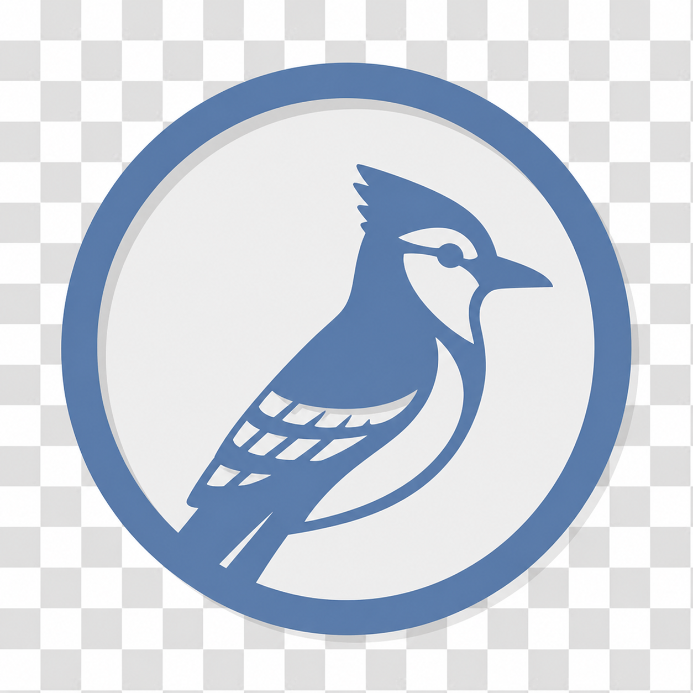

<div align="center">



# Corvida

**A cross-platform Kanban board suite — desktop app, REST API, and an MCP server so LLMs can manage your boards.**

[](LICENSE)
[](https://dotnet.microsoft.com/download)
[](https://avaloniaui.net/)
[](#)

</div>

---

Corvida is a Kanban board manager built around a shared core: a desktop client, a hosted REST API, and a Model Context Protocol (MCP) server that lets an LLM create boards, move tasks, and manage your workflow directly.

## Table of Contents

- [Features](#features)
- [Architecture](#architecture)
- [Installation](#installation)
  - [Desktop App](#desktop-app)
  - [REST API](#rest-api)
  - [MCP Server](#mcp-server)
- [Configuration](#configuration)
- [Development](#development)
- [Data Storage](#data-storage)
- [Contributing](#contributing)
- [License](#license)

## Features

- Create and manage multiple boards
- Organize tasks into customizable columns (e.g. To-Do, In Progress, Done)
- Write task descriptions in Markdown
- Task priorities and planned start/end dates
- Light and dark theme support
- Store data locally as files, or centrally through the REST API
- Manage boards and tasks from an LLM via the bundled MCP server

## Architecture

Corvida is split into focused projects that share a common core:

| Project | Type | Role |
|---|---|---|
| `Corvida` | Desktop app | Avalonia UI client |
| `Corvida.Api` | ASP.NET Core | REST API backed by PostgreSQL |
| `Corvida.Mcp` | Console (stdio) | MCP server exposing Kanban tools to LLMs |
| `Corvida.Core` | Class library | Shared models and service layer |
| `Corvida.AppHost` | .NET Aspire | Local orchestration of the API + PostgreSQL |
| `Corvida.ServiceDefaults` | Class library | Shared Aspire service defaults for `Corvida.Api` |

The desktop app and MCP server both depend on `Corvida.Core` and can talk either to the local filesystem or to `Corvida.Api` over HTTP — see [Data Storage](#data-storage).

## Installation

### Prerequisites

- [.NET 10 SDK](https://dotnet.microsoft.com/download)
- [Docker](https://www.docker.com/) or [Podman](https://podman.io/) — only needed to run `Corvida.Api` in a container

### Desktop App

```bash
git clone https://github.com/k0zi/Corvida.git
cd Corvida/src
dotnet run --project Corvida/Corvida
```

By default the app stores boards and tasks locally under `~/CorvidaData/` — no server required.

To install a standalone build:

```bash
dotnet publish Corvida/Corvida/Corvida.csproj -c Release -o /path/to/install/dir
```

### REST API

Run `Corvida.Api` with PostgreSQL using Docker or Podman Compose (from the repo root):

```bash
docker compose up --build   # or: podman compose up --build
```

This builds the API image and starts it alongside PostgreSQL, exposing the API on `http://localhost:5000`.

> **Podman users:** make sure the Podman API socket is running first, since Compose talks to it over the Docker-compatible API:
> ```bash
> systemctl --user enable --now podman.socket
> export DOCKER_HOST=unix:///run/user/$(id -u)/podman/podman.sock
> ```

Alternatively, run everything locally with **.NET Aspire** for a dashboard and hot reload during development:

```bash
cd src
dotnet run --project Corvida.AppHost/Corvida.AppHost.csproj
```

### MCP Server

`Corvida.Mcp` exposes 13 tools (list/create/update/delete boards, groups, and tasks) over stdio via the `ModelContextProtocol` SDK.

**Claude Code** — register it globally so it's available in every project:

```bash
claude mcp add -s user corvida -- dotnet run -c Release --project /path/to/src/Corvida.Mcp/Corvida.Mcp.csproj
```

**Claude Desktop** — add it to `~/.config/claude/claude_desktop_config.json`:

```json
{
  "mcpServers": {
    "corvida": {
      "command": "dotnet",
      "args": ["run", "--project", "/path/to/src/Corvida.Mcp/Corvida.Mcp.csproj"]
    }
  }
}
```

## Configuration

App settings live at `{AppData}/Corvida/settings.json`, shared by the desktop app and MCP server:

```json
{
  "DataPath": "~/CorvidaData",
  "StorageMode": 0,
  "ServerUrl": "http://localhost:5000/"
}
```

| Field | Description |
|---|---|
| `DataPath` | Where local boards/tasks are stored (`StorageMode: LocalFolder` only) |
| `StorageMode` | `0` = `LocalFolder`, `1` = `ServerHosted` |
| `ServerUrl` | Base URL of `Corvida.Api` (`StorageMode: ServerHosted` only) |

## Development

```bash
cd src
dotnet build                        # build all projects
dotnet test                         # run all tests
dotnet test --filter "FullyQualifiedName~SomeTest"   # run a single test
```

## Data Storage

Two modes, controlled by `AppSettings.StorageMode`:

- **LocalFolder** *(default)* — boards and tasks are stored under `~/CorvidaData/`. Each board is a folder containing a `board.json` file and a `tasks/` directory of Markdown files with YAML frontmatter.
- **ServerHosted** — the desktop app and MCP server talk to `Corvida.Api` over HTTP instead, which persists boards and tasks in PostgreSQL.

## Contributing

Issues and pull requests are welcome. Please open an issue to discuss significant changes before submitting a PR.

## License

MIT — see [LICENSE](LICENSE).
